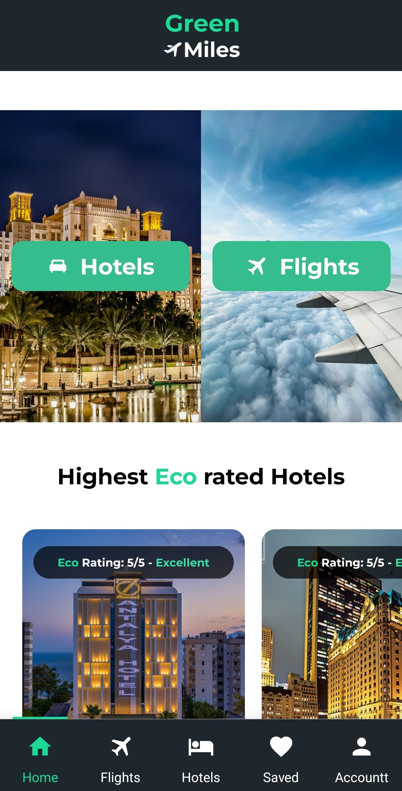

v# Green Miles

**Green Miles** is a mobile app built as a final project, helping users discover and book eco-friendly flights and hotels.  
The goal: Promote sustainable travel by highlighting green-rated accommodation and flight options.

> 📌 *Note: All travel data used in this project is mock/demo only.*

# ✨ Features
- 🔐 Sign Up & Sign In with JWT-based authentication
- 🏨 Search and book eco-rated **hotels**
- ✈️ Search and book eco-rated **flights**
- ❤️ Save favorites (hotels & flights)
- 📱 Mobile UI built with React Native
- 🌐 RESTful API using Express.js
- 🗄️ MongoDB for database management

---

## 🛠️ Tech Stack
| Layer     | Technology                  |
|-----------|-----------------------------|
| Frontend  | React Native                |
| Backend   | Node.js + Express.js        |
| Database  | MongoDB                     |
| Auth      | JSON Web Tokens (JWT)       |
| Version Control | Git + GitHub          |

---

 # 📸 Screenshots

<b>Home Screen &nbsp;&nbsp;&nbsp;&nbsp; Sign In &nbsp;&nbsp;&nbsp;&nbsp; Search Hotels</b>

  
  
  

<b>Found Hotels &nbsp;&nbsp;&nbsp;&nbsp; Saved Hotels</b>

  
  

